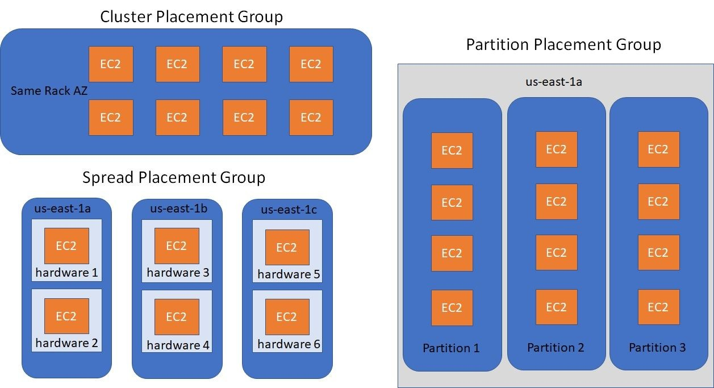

## Elastic Network Interface (ENI)

An ENI is a logical networking component in a VPC that represents a virtual network card for an EC2 instance.

### Key Attributes:

* One **primary private IPv4**, with optional secondary private IPs
* One **Elastic IP** per private IPv4
* One **Public IPv4** (optional)
* One or more **security groups**
* A **MAC address**

### Key Capabilities:

* Can be created independently of EC2 instances
* Can be attached or detached on the fly between instances (useful for **failover scenarios**)
* Tied to a specific **Availability Zone**

> Use Case: Failover setup, network-level separation, custom network configurations

---

## Elastic IP (EIP)

An Elastic IP is a **static public IPv4 address** you can allocate to your AWS account and associate with EC2 instances.

### Benefits:

* Helps mask the failure of an instance or software by **remapping the IP** to another instance in your account

### Limitations:

* **Soft limit of 5** Elastic IPs per region (can request increase)
* **Avoid overuse** of EIPs in production:

  * Overuse may indicate poor architectural decisions
  * Instead, prefer dynamic public IPs with DNS mapping

> Use Case: Static public endpoints, failover configurations, long-lived services

---

## Placement Groups

Placement groups control how EC2 instances are placed on the underlying hardware to meet specific workload requirements.

### Types of Placement Groups:

#### 1. Cluster Placement Group

* Instances are **placed close together** within a single AZ
* Provides **low-latency** and **high-throughput** networking
* Ideal for **HPC** (High Performance Computing) workloads

#### 2. Spread Placement Group

* Instances are placed across **distinct hardware racks**
* Reduces risk of simultaneous failures
* Supports up to **7 instances per AZ**
* Ideal for **critical workloads** with high availability needs

#### 3. Partition Placement Group

* Instances are split into **logical partitions**
* Each partition is isolated from others on separate racks
* Great for **big data** workloads (e.g., HDFS, Kafka, Cassandra)
* AWS ensures no two partitions share racks

---

## EC2 Hibernate

Hibernate is an EC2 instance feature that saves the **in-memory state** (RAM) to disk so the instance can resume faster later.

### What Happens:

* RAM state is written to the **root EBS volume** (must be encrypted)
* On resume, the OS **does not reboot** — it continues from where it left off

### Benefits:

* **Faster boot** time than stop/start
* **Preserves application state** across stops
* Useful for workloads with long startup time or session state

### Requirements:

* Supported families: C3, C4, C5, I3, M3, M4, R3, R4, T2, T3, etc.
* RAM must be **< 150 GB**
* Root volume must be **EBS-backed, encrypted** (not instance store)
* Not supported for **bare metal** instances
* Supported on **On-Demand, Reserved, and Spot** instances
* Hibernate duration **limited to 60 days**

> Use Case: Long-running services, pre-warmed applications, user sessions

---

## Summary

| Feature              | Key Benefit                             | When to Use                                |
| -------------------- | --------------------------------------- | ------------------------------------------ |
| **ENI**              | Custom network configurations, failover | Dynamic networking, HA scenarios           |
| **Elastic IP**       | Static public address for remapping     | Public-facing services, failover           |
| **Placement Groups** | Control physical instance placement     | High throughput, fault tolerance, big data |
| **Hibernate**        | Preserves RAM state, faster startup     | Stateful apps, pre-warmed environments     |
