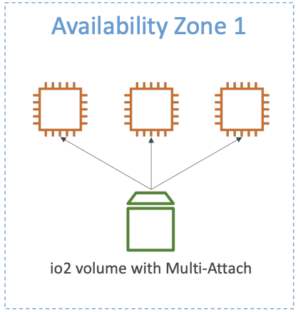
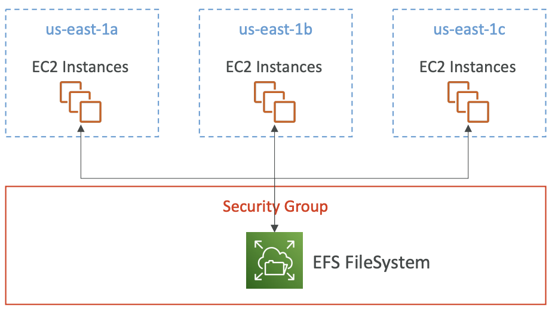

## **Amazon EC2 Storage Overview: EBS, EFS, Instance Store**

### 1. **Amazon EBS (Elastic Block Store)**

#### ✅ **Basics**

* **Type:** Block storage (like a virtual hard disk).
* **Attached to:** A single EC2 instance at a time (except for Multi-Attach volumes).
* **Use cases:** Databases, file systems, boot volumes.

#### ✅ **Volume Types**

| Volume Type | Use Case                                      | Max IOPS                    | Max Throughput | Notes                           |
| ----------- | --------------------------------------------- | --------------------------- | -------------- | ------------------------------- |
| **gp2**     | General purpose                               | 16,000                      | 250 MiB/s      | Performance tied to volume size |
| **gp3**     | General purpose (new gen)                     | 16,000                      | 1,000 MiB/s    | Baseline IOPS is configurable   |
| **io1/io2** | IOPS-intensive apps (DBs)                     | 256,000 (io2 Block Express) | 4,000 MiB/s    | High performance and durability |
| **st1**     | Throughput-focused (log processing, big data) | 500                         | 500 MiB/s      | Not good for small, random I/O  |
| **sc1**     | Cold HDD (archive)                            | 250                         | 250 MiB/s      | Cheapest                        |

#### ✅ **Multi-Attach for io1/io2**

* Allows attaching a single io1/io2 volume to **up to 16 EC2 instances** in the **same AZ**.
* All instances have **read/write access**.
* Use cases: **High-availability clustered applications** (e.g., SAP HANA, Teradata).
* ⚠️ Requires **cluster-aware file systems** (like GFS2 or OCFS2), not EXT4 or XFS.

#### ✅ **Snapshots**

* Point-in-time backup of a volume stored in **Amazon S3**.
* Snapshots are **incremental** after the first one.
* You can create:

  * New volumes from snapshots (even in different AZs/regions).
  * **AMIs** from root volume snapshots.
* **Encryption:**

  * Unencrypted → Encrypted: Create snapshot → Copy it with encryption → Create volume.
  * Once encrypted, **encryption stays on** by default in all new volumes from that snapshot.

#### ✅ **Limitations**

* Volumes are **AZ-bound**, but snapshots are **region-scoped** (can copy to other regions).

---

### 2. **Amazon EFS (Elastic File System)**

#### ✅ **Basics**

* **Type:** Managed **Network File System (NFS)**.
* **Access:** Multiple EC2s across multiple AZs (fully regional).
* **Use cases:** Shared file storage, web hosting, content management, ML pipelines.

#### ✅ **Performance Modes** (chosen at creation)

| Mode                          | Use Case                   | Notes                             |
| ----------------------------- | -------------------------- | --------------------------------- |
| **General Purpose** (default) | Web apps, CMS              | Lower latency                     |
| **Max I/O**                   | Big data, media processing | Higher throughput, higher latency |

#### ✅ **Throughput Modes**

| Mode            | Description                                          | Use Case                |
| --------------- | ---------------------------------------------------- | ----------------------- |
| **Bursting**    | Based on size (1 TB = 50 MiB/s + burst to 100 MiB/s) | Default mode            |
| **Provisioned** | Fixed throughput (e.g., 1 GiB/s for 1 TB)            | High-performance needs  |
| **Elastic**     | Scales automatically                                 | Unpredictable workloads |

* Max: **3 GiB/s reads**, **1 GiB/s writes**

#### ✅ **Storage Tiers** (via lifecycle policies)

| Tier                       | Description   | Use Case                  |
| -------------------------- | ------------- | ------------------------- |
| **Standard**               | Default       | Frequently accessed       |
| **Infrequent Access (IA)** | Retrieval fee | Lower cost for cold data  |
| **Archive**                | Deep archival | Rarely accessed, cheapest |

---

### 3. **Instance Store**

#### ✅ **Basics**

* **Type:** Ephemeral block storage physically attached to host.
* **Use cases:** Caches, buffers, temporary storage, scratch data.
* **High IOPS & low latency.**

#### ✅ **Limitations**

* **Tied to instance lifecycle.** Data is lost when:

  * Instance stops.
  * Instance terminates.
* **Cannot be detached** or moved across instances.
* Not all instance types have instance store (e.g., t3 does not; i3 does).

#### ✅ **Use Cases**

* In-memory databases with persistence elsewhere (e.g., Redis + S3 backup).
* Fast temporary working directory.
* Hadoop/EMR intermediate storage.

---

## **AMI (Amazon Machine Image)**

#### ✅ **What is AMI?**

* A **template** for EC2 instances:

  * OS
  * Pre-installed packages
  * Application config
  * Root volume snapshot

#### ✅ **Use Cases**

* Custom golden images with pre-installed software/configs.
* Replicating environments across teams/projects.
* Backup of entire EC2 configuration and root volume.

#### ✅ **Types**

* **Public AMIs** (provided by AWS, Marketplace, or community)
* **Private AMIs** (created by you, shared with specific accounts)

---

## **Network Drive Concept**

* A **storage volume** not directly attached to a single host but accessed over the network.
* Example: **EFS**
* Allows multiple clients/instances to read/write concurrently.
* Managed and scalable.
* ⚠️ Latency depends on network and workload pattern.

---

## ✅ Summary: Use Cases and Comparison

| Feature          | EBS               | EFS           | Instance Store        |
| ---------------- | ----------------- | ------------- | --------------------- |
| **Type**         | Block             | File          | Block                 |
| **Persistence**  | Persistent        | Persistent    | Ephemeral             |
| **AZ-bound**     | Yes               | No (multi-AZ) | Yes                   |
| **Multi-attach** | Only io1/io2      | Native        | No                    |
| **Latency**      | Low               | Moderate      | Ultra-low             |
| **Use cases**    | DBs, boot volumes | Shared access | Caches, scratch space |

---

