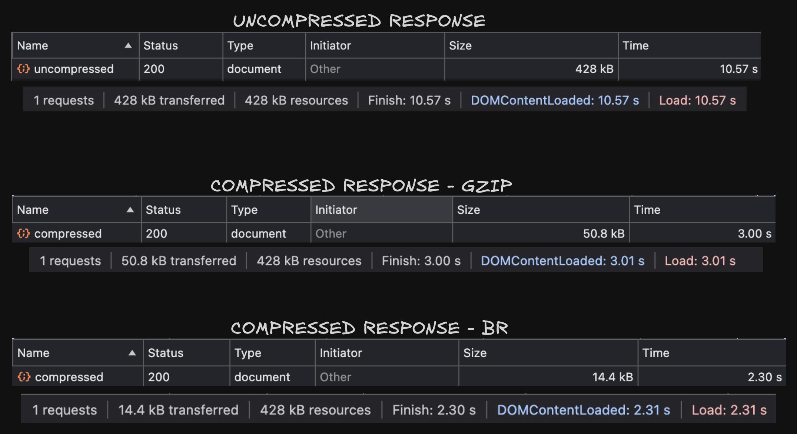

---

id: json-compression
title: JSON Payload Compression
---

## Why Compress JSON Responses?

In REST APIs, large JSON payloads can lead to:

* Increased network latency
* Poor performance on mobile or slow connections
* Higher bandwidth and infrastructure costs

Text compression helps reduce payload size dramatically using algorithms like **Gzip** and **Brotli**, which exploit repetition and structure in JSON.

Modern browsers and clients **automatically decompress** responses based on the `Content-Encoding` header, with no changes needed in client-side code.

---

## Sample JSON Format

```
const data = Array.from({ length: 10000 }, (_, i) => ({
  id: i,
  email: `user${i}@example.com`,
}));
```

This generates a JSON array with 10,000 user objects.

---

## Server Code (Express + Compression Middleware)

```
const express = require('express');
const compression = require('compression');
const app = express();

const data = Array.from({ length: 10000 }, (_, i) => ({
  id: i,
  email: `user${i}@example.com`,
}));

const payload = JSON.stringify({ users: data });

app.get('/uncompressed', (req, res) => {
  res.setHeader('Content-Type', 'application/json');
  res.send(payload);
});

app.get('/compressed', compression(), (req, res) => {
  res.setHeader('Content-Type', 'application/json');
  res.send(payload);
});

app.listen(3000, () => console.log('Server running on port 3000'));
```

The `/compressed` route automatically applies compression (Gzip or Brotli) based on the request’s `Accept-Encoding` header.

---

## Benchmark Results

### Environment

* Chrome DevTools
* Network profiles: No throttling, Slow 3G
* Payload: 10,000 user objects

### No Throttling

| Response Type | Size    | Load Time |
| ------------- | ------- | --------- |
| Uncompressed  | 417 KB  | 18 ms     |
| Gzip          | 50.8 KB | 17 ms     |
| Brotli        | 14.4 KB | 12 ms     |

### Slow 3G

| Response Type | Size    | Load Time |
| ------------- | ------- | --------- |
| Uncompressed  | 417 KB  | 10.59 s   |
| Gzip          | 50.8 KB | 3.02 s    |
| Brotli        | 14.4 KB | 2.31 s    |

---

## How Compression Works

* **Gzip**: Uses DEFLATE algorithm (LZ77 + Huffman coding)
* **Brotli**: More efficient than Gzip, especially for large text-based responses
* Express’ `compression()` middleware handles negotiation using the `Accept-Encoding` header

Browser example:

```
Accept-Encoding: gzip, deflate, br
```

The server responds with:

```
Content-Encoding: br
```

The browser automatically decompresses the response — no manual steps needed.

---

## Trade-offs of Compression

### ✅ Pros

* Large size reduction (up to \~90%)
* Faster load times
* Better performance on constrained networks

### ⚠️ Cons

* **CPU Overhead**: Compressing responses consumes CPU, especially Brotli (which prioritizes better compression ratio over speed).
* For very small payloads (`<1KB`), the overhead might outweigh the gains

---

## When to Use JSON Compression

Enable compression for:

* Large or repetitive payloads (e.g., arrays of users, logs, products)
* Public APIs serving mobile clients or users with slower networks

Avoid compression for:

* Small, low-latency APIs (e.g., auth tokens, feature toggles)
* CPU-constrained environments under heavy load

---

## Summary

Enabling Gzip/Brotli compression for JSON responses:

* Significantly reduces payload size and network latency
* Is well-supported by browsers (decompression is automatic)
* Comes with a small CPU trade-off on the server

For most REST APIs returning sizable JSON, this is a **low-effort, high-impact optimization**.
