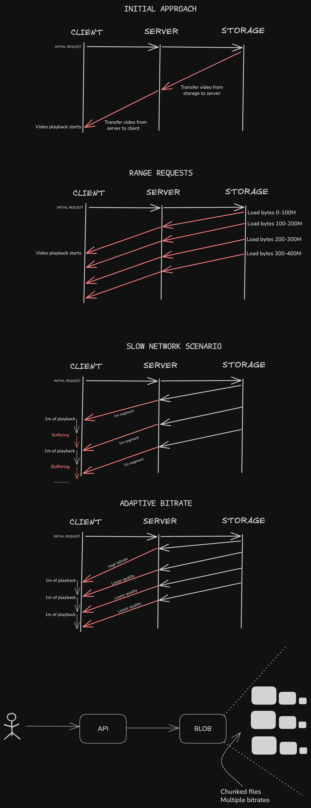

# VOD Streaming Architecture

*(Blob Storage, HLS, MPEG-DASH, CMAF, DRM — for VOD)*

> ⚠️ **Problem:** How do platforms stream large, pre-recorded videos (education, training, entertainment) to different devices reliably — while supporting adaptive bitrate, playback controls, and content protection — all from blob storage?

> 🧠 This is just how I currently understand it. Not a polished tutorial, just working notes while figuring things out.

---

## 🗕️ 1. What is Video Streaming?

**Streaming** = serving small chunks of a video instead of full downloads. Essential for:

* Low memory usage
* Instant playback
* Adaptive video quality
* Resume support

---

## 📄 2. Uploading Video to Blob Storage

### 💡 What Happens:

1. A user uploads a video (`.mp4`) to the backend.
2. It gets pushed to blob storage (Azure, S3, etc.).
3. Upload secured via signed URL / SAS token.

### 🗂 Folder Structure:

```bash
course-videos/
  └ raw/
      └ video123.mp4
```

---

## 🎞️ 3. Transcoding & Adaptive Bitrate

**Why transcode?** One `.mp4` won’t work well across devices or networks.

### So we:

1. Generate multiple resolutions: 1080p, 720p, 480p...
2. Use codecs: `H.264`, `H.265`, `VP9`, etc.
3. Chunk the video into 2–10s segments
4. Create a **master playlist** (`.m3u8` or `.mpd`)

### 🗂 Output Folder:

```bash
course-videos/processed/video123/
  ├ master.m3u8
  ├ 1080p/
  ├ 720p/
  └ 480p/
```

---

## 🌐 4. HLS vs MPEG-DASH

| Feature         | HLS          | MPEG-DASH      |
| --------------- | ------------ | -------------- |
| By              | Apple        | MPEG Alliance  |
| Manifest Format | `.m3u8`      | `.mpd`         |
| Segment Type    | `.ts`        | `.m4s`         |
| Apple Support   | ✅ Native     | ❌ Limited      |
| Codec Support   | H.264, H.265 | VP9, AV1, more |

✅ Both support:

* Adaptive bitrate switching
* Chunked delivery
* Resume playback

---

## 📦 5. CMAF: One Format to Rule Them All

**CMAF (Common Media Application Format)** solves a big headache:

> Instead of generating different formats for HLS and MPEG-DASH, just generate **one**: `.m4s`.

### Benefits:

* Works with both `.m3u8` and `.mpd`
* Less storage duplication
* Easier to test and scale

---

## 🔧 6. Encoding + Chunking

Use `FFmpeg`, `Bento4`, or `Shaka Packager` to:

* Transcode videos
* Chunk into `.m4s` segments
* Generate the manifest files

### Sample FFmpeg for HLS:

```bash
ffmpeg -i input.mp4 -c:v libx264 -c:a aac -f hls \
  -hls_time 6 -hls_playlist_type vod \
  -master_pl_name master.m3u8 \
  -var_stream_map "v:0,a:0" \
  output_%v.m3u8
```

---

## 📺 7. Frontend Playback

### Players I’m Exploring:

* **HLS.js** – browser-based HLS playback
* **Shaka Player** – DASH + HLS + DRM
* **Video.js** – plugin-based flexible player

### Playback Flow:

1. Player loads `.m3u8` / `.mpd`
2. Auto-selects quality
3. Requests `.m4s` chunks
4. Handles buffering, seeking, etc.

---

## 🔐 8. DRM: Content Protection

Encrypted videos + license servers ensure content can’t be downloaded or pirated easily.

### 🔒 DRM Types:

| DRM       | Platforms       |
| --------- | --------------- |
| Widevine  | Chrome, Android |
| PlayReady | Edge, Windows   |
| FairPlay  | Safari, iOS     |

💡 Combine DRM with signed URLs or JWT headers for added security.

---

## ☁️ 9. Storage Strategy

```bash
/raw/          ← original uploads
/processed/    ← transcoded segments
/thumbnails/   ← optional previews
```

* Store all processed chunks in blob
* Secure access with SAS tokens / headers
* Serve via CDN (Azure, Cloudflare)

---

## ⏯ 10. Resume Playback

Track position in DB:

```sql
user_video_progress (
  user_id INT,
  video_id INT,
  last_position_seconds INT
)
```

Then resume where the user left off.

---

## ⚖️ 11. Trade-offs

| Aspect         | Trade-off                          |
| -------------- | ---------------------------------- |
| Storage        | Increases with multiple renditions |
| Complexity     | Requires pipeline setup            |
| CDN Cost       | Can grow with traffic + chunks     |
| Device Support | Test across phones, browsers, etc. |

---

## 📊 12. What to Track (Analytics)

* Playback errors (403/404)
* Buffering %
* Watch time
* Quality switching events

Tools I might use: Azure Monitor, Segment, Mixpanel, Datadog

---

## 🔧 13. Things To Know Further

| Feature            | Idea                       |
| ------------------ | -------------------------- |
| Subtitles (VTT)    | Multilingual support       |
| Thumbnails on seek | Hover previews             |
| Transcription      | AI searchable video        |
| Offline mode       | Mobile download support    |
| Clip sharing       | Share video with timestamp |

---

## 🧱 14. Architecture Diagram

```text
[User Upload]
      ↓
[Blob Storage /raw]
      ↓
[Trigger: Encoding]
  ↳ Generate resolutions
  ↳ Segment into .m4s (CMAF)
  ↳ Create master.m3u8 / .mpd
      ↓
[Blob /processed]
      ↓
[CDN delivery]
      ↓
[Frontend Player: HLS.js / Shaka]
      ↓
↪ Resume, Analytics, Secure Playback
```

---

## 🧭 15. Visual Model



1. Direct download (inefficient)
2. Range-based video (seekable)
3. Fixed quality streaming
4. Adaptive HLS/DASH
5. CMAF + CDN delivery = modern VOD

---

## ✅ 16. Learnings So Far

* Use **CMAF** if you want one format for both HLS + DASH
* Choose player based on needs (HLS.js, Shaka, Video.js)
* **Secure** everything: signed URLs + DRM
* Offload to CDN as early as possible
* Store all segments organized by resolution
* Track resume position, errors, engagement

🧠 Further topics: low-latency live streaming, DRM licensing flows, mobile offline handling, per-title encoding...

---
