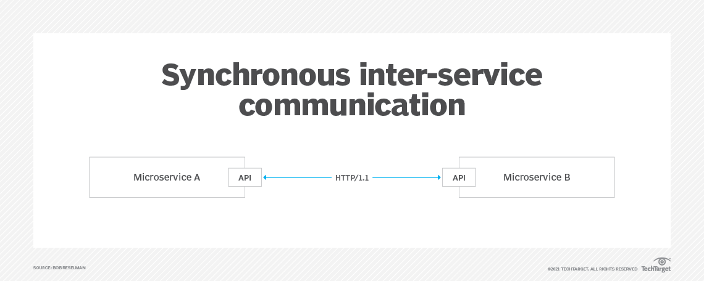
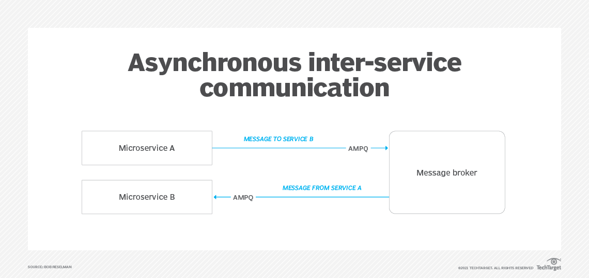
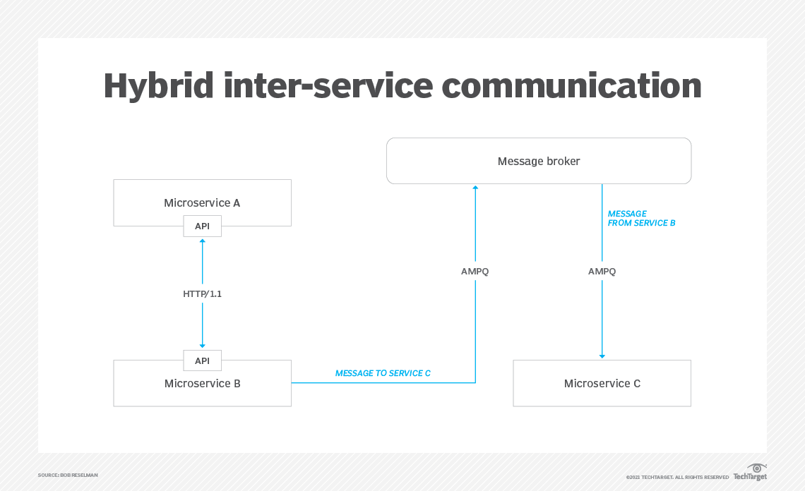

# 📡 Microservices Communication: Synchronous vs Asynchronous
## 🔗 Synchronous Communication

### ✅ Definition

* Real-time request-response pattern.
* The calling service waits (blocks) for the callee’s response.

### 💡 Common Technologies

* HTTP/REST
* gRPC
* GraphQL (query mode)
* SOAP

### 📌 Typical Use Cases

* User-facing flows: login, payment authorization, placing orders.
* Real-time actions needing immediate confirmation or result.
* Booking and reservation systems.

### ✅ Pros

* Simple and straightforward to implement.
* Easy to debug and trace.
* Provides immediate feedback to the user.
* Easier for transactional workflows.

### ❌ Cons

* Tight coupling between services.
* Blocking leads to limited scalability.
* One slow or failing service can bring down the whole chain.
* Requires resilience techniques (e.g., circuit breakers).

### 🔧 Implementation Methods

| Method          | Description                                  |
| --------------- | -------------------------------------------- |
| HTTP/REST       | Most common, widely supported                |
| gRPC            | High-performance RPC with schema enforcement |
| GraphQL         | Efficient data querying and flexibility      |
| API Gateway     | Centralized routing, monitoring, and auth    |
| Service Mesh    | Observability, retries, load balancing       |
| Circuit Breaker | Prevents cascading failures                  |

### 🕒 When to Use

* When immediate response is essential (e.g., checkout).
* Where strong consistency is critical.
* For short, predictable workflows.

---

## 📨 Asynchronous Communication

### ✅ Definition

* Non-blocking, event/message-based communication.
* The sender does not wait for the response.

### 💡 Common Technologies

* Kafka
* RabbitMQ
* Azure Service Bus
* AWS SNS/SQS

### 📌 Typical Use Cases

* Background processing: file uploads, video encoding.
* Notification systems.
* Order processing queues.
* Event-driven systems (user sign-up triggers email, etc).

### ✅ Pros

* High scalability and loose coupling.
* Greater fault tolerance.
* Supports eventual consistency.
* Systems can evolve independently.

### ❌ Cons

* More complexity in design and operations.
* Difficult to monitor and trace flows.
* Delayed feedback to users.
* Requires robust error handling (e.g., DLQs, retries).

### 🔧 Implementation Methods

| Method          | Description                                       |
| --------------- | ------------------------------------------------- |
| Message Queues  | Decouples sender and receiver                     |
| Pub/Sub Systems | Publishers emit events; subscribers act on them   |
| Event Sourcing  | State changes are stored as events                |
| CQRS            | Read/write segregation, often with events         |
| Saga Pattern    | Distributed transaction with compensating actions |

### 🕒 When to Use

* When immediate result is not required.
* When systems need to operate independently.
* For operations that benefit from batch or background processing.

---

## ⚖️ Quick Comparison

| Characteristic   | Synchronous         | Asynchronous                     |
| ---------------- | ------------------- | -------------------------------- |
| Blocking         | ✅ Yes               | ❌ No                             |
| Coupling         | Tight               | Loose                            |
| Scalability      | Lower               | Higher                           |
| Response Time    | Immediate           | Eventual                         |
| Use Cases        | Payments, logins    | Emails, notifications, analytics |
| Failure Handling | Harder              | Easier (with retries, DLQs)      |
| Technologies     | REST, gRPC, GraphQL | Kafka, RabbitMQ, Pub/Sub         |
| Data Consistency | Strong              | Eventual                         |

---

## 🧠 Key Design Takeaways

* Hybrid communication is standard in modern microservices.
* Use sync when you need immediate response; async when scaling and resilience are more important.
* Always plan for observability and failure recovery (timeouts, retries, dead-letter queues).
* Async systems tend to be more scalable and resilient but require careful design.

---

## Diagrams

### 📞 Figure 1: Synchronous Communication (HTTP request/response)

### 📩 Figure 2: Asynchronous Communication (via Message Broker)

### 🔄 Figure 3: Hybrid Communication Model
