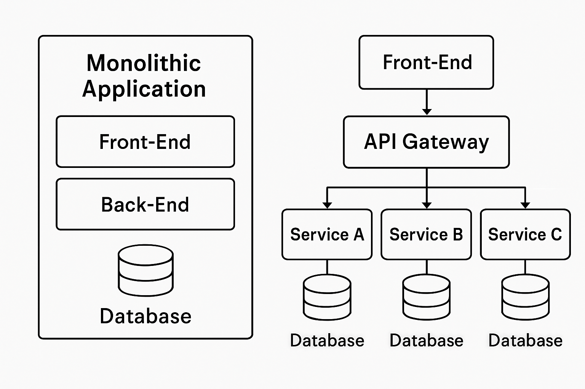

# 🏗️ Monolithic vs 🧩 Microservices Architecture

## 📌 Overview

Modern software systems are typically built using either **monolithic** or **microservices** architecture. Both have distinct design principles, benefits, and trade-offs. This document presents a deep comparison, including real-world examples and usage strategies.

---

## 📖 1. Definitions

### 🧱 Monolithic Architecture

A single unified application where all components (UI, business logic, data access, etc.) are bundled and deployed together. It runs as a single process.

**Characteristics:**
- 🧩 Single codebase
- 🚀 Single deployable unit
- 🗄️ Shared database
- 🔗 Tight coupling between modules

### 🔌 Microservices Architecture

An architectural style where the application is decomposed into multiple smaller, independent services. Each service is focused on a specific business capability and communicates over a network (typically HTTP/REST or messaging queues).

**Characteristics:**
- 📦 Multiple independent codebases
- 🛢️ Decentralized data management (per-service databases)
- ⚙️ Independent deployment pipelines
- 🔓 Loosely coupled services

---

## 🌐 2. Real-World Examples

### 🧱 Monoliths in Practice
- 🛒 **Early Amazon**: Monolithic online bookstore.
- 🏦 **Legacy Banking Systems**: Stable and tightly coupled.
- 📰 **CMS Platforms**: WordPress, Magento.

### 🔌 Microservices in Practice
- 🎬 **Netflix**: 700+ microservices for features like streaming, recommendations.
- 🚗 **Uber**: Transitioned to 500+ microservices.
- 🎵 **Spotify**: Domain-focused services for fast deployment.
- 🛍️ **Modern Amazon**: Migrated for agility and scale.

---

## 🔍 3. Comparison Table

| Feature              | 🧱 Monolithic                         | 🔌 Microservices                            |
|----------------------|----------------------------------------|----------------------------------------------|
| **Complexity**       | Low to start                           | High upfront                                 |
| **Deployment**       | Single unit                            | Multiple independent services                |
| **Scalability**      | Whole app scales together              | Per-service scaling                          |
| **Team Structure**   | Centralized                            | Decentralized teams                          |
| **Tech Stack**       | Unified                                | Polyglot (flexible per service)              |
| **Reliability**      | Single point of failure                | Failure isolation                            |
| **Testing**          | App-level                              | Service-level                                |
| **Data Sharing**     | Shared DB                              | DB per service                               |
| **Startup Fit**      | ✅ Ideal                               | ⚠️ Complex                                   |

---

## 🤔 4. When to Use Which

### ✅ Choose **Monolith** If:
- 🚀 Product is small or just starting out
- 👥 Team is small and collaborates closely
- 🧹 Simplicity and speed > flexibility
- 💼 Minimal ops infrastructure

### ✅ Choose **Microservices** If:
- 📈 Product is large or growing rapidly
- 🔄 Components need to scale independently
- 🚢 Continuous delivery and team autonomy is key
- 👥 Many teams work on different parts of system

---

## 🔄 5. Common Transition Strategy

1. 🧱 **Modular Monolith**: Structure modules cleanly first
2. 🎯 **Identify Bottlenecks**: Find services that need independence
3. 🔧 **Extract Gradually**: API contracts, interfaces
4. 👀 **Add Observability**: Logs, traces, metrics
5. 🛡️ **Add Reliability Tools**: Discovery, load-balancing, retries

---

## 🧠 6. Key Concepts in Microservices

- 🎯 **Bounded Contexts**: One domain per service
- 🛠️ **Decentralized Governance**: Tool & language freedom
- 🧱 **Resilience Patterns**: Circuit breakers, retries, timeouts
- 📨 **Event-Driven**: Async messaging (e.g., Kafka, RabbitMQ)

---

## ⚠️ 7. Challenges

### 🧱 Monolithic Challenges
- 🔄 Hard to scale individual features
- 🐢 Slow deployments as app grows
- 💥 One bug = full crash
- 👥 Developer collisions in large teams

### 🔌 Microservices Challenges
- 🧩 Complex infra & orchestration (e.g., Docker, Kubernetes)
- 🕵️‍♂️ Harder to debug across services
- 🌐 Network reliability issues
- 🔄 Repeating cross-cutting concerns (auth, logging)

---

## ✅ 8. Final Thoughts

There’s no silver bullet. Start simple. If you're small, focus on delivering features fast using a monolith. As complexity and team size grow, **modularize** and **gradually migrate** to microservices only where they provide clear benefits.

---

## 🧾 Summary Table

| Criteria                 | Best Fit Architecture     |
|--------------------------|---------------------------|
| 🛠️ Rapid development        | Monolith                  |
| 👥 Small team               | Monolith                  |
| 📈 Independent scaling      | Microservices             |
| 🚀 Frequent deployments     | Microservices             |
| 🧠 Complex domains          | Microservices             |
| 🧰 Limited ops experience   | Monolith                  |

---

## 🗺️ Architecture Diagram

